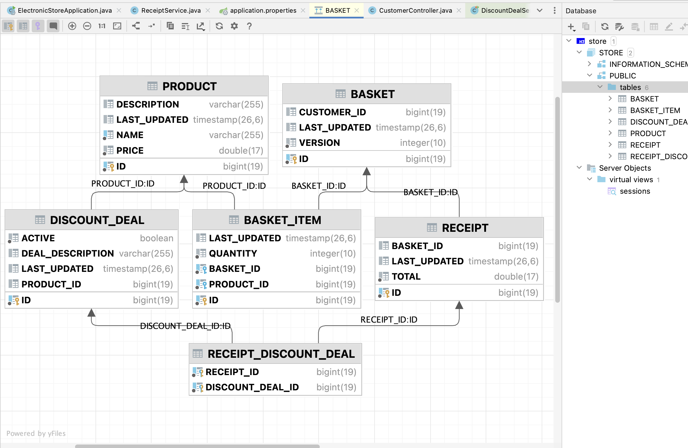

# Electronic Store Application
This Spring Boot application serves as the backend for an electronic store. It handles product management, discount deals, customer baskets, and receipt calculation.

## Features

* Admin Operations:
  * Create and remove products, add discount deals.
* Customer Operations:
  * Add/remove products to/from a basket, calculate receipts with deals applied.
* Concurrent Access Management: Ensures safe concurrent operations on products and baskets.
* In-Memory Database Integration: Utilizes H2 database for fast, in-memory data storage and retrieval.
* Discounts Deals, for now can be added as, as for now they can match to these patterns and apply discounts in-lined to these formats (deals)
  * Buy N Get M free
  * Buy N Get 50% off on the next.


## Project Structure
* Entities: Represents data models - Product, Basket, BasketItem, DiscountDeal, Receipt.
* DTOs: Data Transfer Objects- ProductDTO, BasketDTO, DiscountDealDTO, ReceiptDTO, BasketItemDTO for transferring data between layers.
Repositories: Interfaces for database operations.
* Uses Lombook: for all pojo code, getters, setters, constructors, to reduce boiler plate code.
* Services: Business logic implementations.
* Controllers: RESTful endpoints - 
  * AdminController for administrative tasks.
  * CustomerController for customer-related actions.
* Exception Handling: Custom exception handling and Global exception handling for Database exceptions consistent error responses.
* Testing: Unit test and Integration tests with in-memory database setup.

## Database Tables
* Product - product table
* Basket - basket table for customer (here we have version field implemented)
* discount_deal - houses discount for each product, at one point only one discount will be active for product
* receipt - houses the receipt generated for customer on checkout (calculates the total price customer has to pay for each item in his basket with any applied discount deals)
* basket_item - each basket can have many basket_items that has product with qty
* receipt_discount_item - mapping that stores if there was any discount deal being used while calculating that receipt




## Prerequisites
* Java JDK 8 or higher
* Maven (for building and running the application)

## Running the Application
* To start the application, use the following command:, this will use the port 8080, to start application
```shell
java -jar target/electronicstore-1.0-SNAPSHOT.jar 
```
* To start the application on a specific port, use:
```shell
java -jar target/electronicstore-1.0-SNAPSHOT.jar --server.port=8081
```

## Running Tests
* To run tests, use the following command:
```shell
mvn test
```

## Building Application
* To build application and package for new jar
```shell
mvn clean package
```

## Swagger API Documentation
This application is equipped with Swagger UI, providing an interactive documentation and testing interface for the API.

### Accessing Swagger UI
* To access the Swagger UI:
    * Ensure the application is running. (See Running the Application)
    * Open a web browser and navigate to http://localhost:8080/swagger-ui/index.html.
    
### Using Swagger UI
* In the Swagger UI, you can:
    * View Documentation: Explore the list of available REST endpoints, their expected request formats, and response models.
    * Try Out Endpoints: Execute API requests directly from the browser. Select an endpoint, fill in the required parameters, and click "Try it out".
#### Note: The provided Swagger UI link assumes the application runs on port 8080. If you start the application on a different port, adjust the URL accordingly.